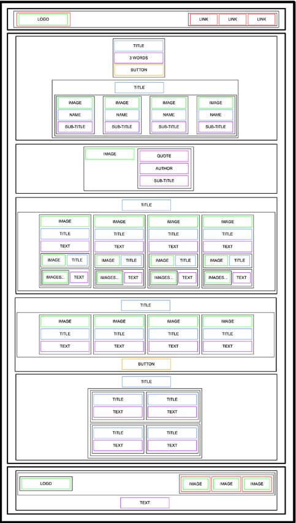

# HTML, advanced
---

- In this project I'm supposed to learn those terms:
    - What is HTML
    - How to create an HTML page from a wireframe
    - What is a markup language
    - What is the DOM
    - What is an element / tag
    - What is an attribute
    - What the purpose of each HTML tag

- I will make somthing like this:

